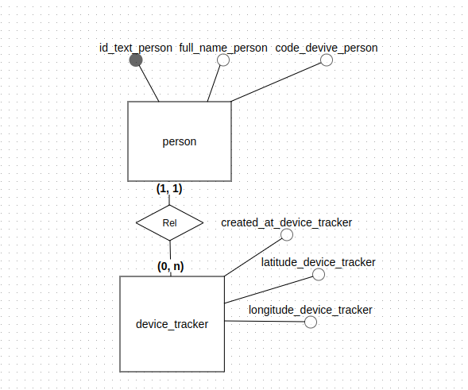

# Documentação Técnica

## 1. Visão Geral do Sistema

### Descrição do Projeto

O projeto tem como objetivo desenvolver uma solução robusta para o armazenamento e consulta de dados de geolocalização
em tempo real, gerados por dispositivos IoT, como wearables, tags e smartphones. Utilizando um banco de dados SQL,
ORACLE CLOUD, a solução será capaz de lidar com grandes volumes de dados, garantindo escalabilidade e alta
disponibilidade. A
arquitetura proposta envolve o uso de Spring Boot para o backend, Vue.js para o frontend e comunicação eficiente via
APIs RESTful e WebSocket. A segurança dos dados será garantida com criptografia e controle de acesso.

## 2. Ambiente e Configurações

### Requisitos do Sistema

#### Backend (Java Spring Boot)

- **Java 17**: Linguagem de programação principal utilizada no backend.
- **Spring Boot 3.3.2**: Framework para criação de aplicações Java, utilizado para simplificar a configuração e
  desenvolvimento.
    - **spring-boot-starter-data-jpa**: Biblioteca para integração com JPA (Java Persistence API), utilizada para
      mapeamento objeto-relacional.
    - **spring-boot-starter-web**: Starter para criação de APIs REST e comunicação HTTP.
    - **spring-boot-starter-test**: Dependência para realizar testes unitários e de integração no projeto.
    - **spring-boot-starter-data-redis**: Para integração com o Redis, utilizado como cache ou armazenamento de dados
      temporários.
- **Flyway**: Biblioteca de controle de versão de banco de dados.
    - **flyway-core**: Gerenciamento de migrações no banco de dados.
    - **flyway-database-oracle**: Suporte para migrações em bancos de dados Oracle.
- **Oracle JDBC**: Driver JDBC para conexão com o banco de dados Oracle.
    - **ojdbc11-production**: Conector Oracle para Java.
    - **oraclepki, osdt_cert, osdt_core**: Bibliotecas de segurança para autenticação e criptografia em conexões com
      Oracle.
- **Lombok**: Ferramenta para reduzir a verbosidade do código Java, automatizando a geração de getters, setters e outros
  padrões de código.
- **ModelMapper**: Biblioteca para mapeamento de objetos Java de forma automática.

#### Frontend (Vue.js com Vite)

- **Vue 3.4.29**: Framework JavaScript para construção de interfaces de usuário.
- **Vite**: Ferramenta para desenvolvimento e build rápido de aplicações Vue.
- **Vue Router 4.3.3**: Biblioteca para controle de rotas no Vue.js.
- **TypeScript (~5.4.0)**: Linguagem baseada em JavaScript com tipagem estática opcional, utilizada no frontend para
  aumentar a segurança do código.
- **Axios 1.7.7**: Cliente HTTP para realizar requisições ao backend.
- **OpenLayers (ol)**: Biblioteca JavaScript para renderização de mapas interativos.
    - **ol-contextmenu**: Extensão para adicionar menus contextuais no mapa.
    - **ol-ext**: Extensões adicionais para OpenLayers.
    - **proj4**: Biblioteca para transformações de projeções cartográficas.
- **PrimeVue 4.0.5**: Biblioteca de componentes UI para Vue.js, usada para criar interfaces dinâmicas e interativas.
- **Vue3-OpenLayers 11.2.0**: Wrapper Vue.js para integração com OpenLayers.

#### Dependências de Desenvolvimento

- **Vite**: Utilizado para rodar e construir o projeto Vue.js.
- **Vue TSC**: Ferramenta de verificação de tipos TypeScript para projetos Vue.js.
- **npm-run-all**: Utilizado para rodar múltiplos scripts npm em paralelo.
- **@vitejs/plugin-vue**: Plugin do Vite para trabalhar com Vue.js.
- **@types/node** e **@tsconfig/node20**: Tipos e configuração de TypeScript para Node.js.

## Setup de Desenvolvimento

Passos para configurar o ambiente de desenvolvimento:

### 1. Clone o repositório

Clone o projeto para sua máquina local utilizando o seguinte comando:

```bash
git clone git@github.com:manolito-fatec/repo-gamer-2024-1.git
```

```bash
git clone git@github.com:manolito-fatec/repo-notgamer-front-2024-1.git
```

### 2. Backend (Spring Boot)

Entre no diretório do backend e instale as dependências Maven:

```bash
cd repo-gamer-2024-1/
./mvnw clean install
```

### 3. Frontend (Vue.js)

Entre no diretório do frontend e instale as dependências do projeto com npm ou yarn:

```bash
cd repo-notgamer-front-2024-1/
npm install
# ou
yarn install
```

### 4. Docker Compose

Se o projeto inclui serviços adicionais como banco de dados, cache (Redis), etc., eles podem ser configurados e
iniciados com Docker Compose. Certifique-se de ter o Docker e o Docker Compose instalados em sua máquina.

Para iniciar os containers, execute o seguinte comando no diretório raiz do projeto:

```bash
docker-compose up -d
```

### 5. Rodando a Aplicação

Backend
Inicie o servidor Spring Boot utilizando o Maven:

```bash
cd backend/
./mvnw spring-boot:run
```

Frontend
Inicie o servidor de desenvolvimento Vue.js:

```bash
cd frontend/
npm run dev
# ou
yarn dev
```

## 3. Tecnologias e Ferramentas Utilizadas

|                                                         | Tecnologia   | Versão | Descrição                                            |
|---------------------------------------------------------|--------------|--------|------------------------------------------------------|
|        | Java         | 17     | Linguagem de programação utilizada                   |
|      | Spring Boot  | 3.3.2  | Framework para criação de aplicações Java            |
|       | Oracle Cloud | X.X.X  | Banco de dados relacional                            |
|     | Swagger      | X.X.X  | Documentação de API                                  |
|      | Docker       | X.X.X  | Plataforma para containerização de aplicações        |
|         | Vue.js       | 3.4.29 | Framework JavaScript para interfaces de usuário      |
|        | Vite         | 5.3.1  | Ferramenta de build e desenvolvimento para Vue       |
|       | Redis        | X.X.X  | Banco de dados em memória para cache                 |
|         | Git          | X.X.X  | Sistema de controle de versão                        |
|  | TypeScript   | ~5.4.0 | Superset do JavaScript com tipagem estática          |
|      | Lombok       | X.X.X  | Biblioteca para reduzir a verbosidade do código Java |

## 4. Endpoints API (Swagger)

### Acesso à Documentação da API

Você pode acessar a documentação visual da API através do Swagger UI em:

[Swagger-UI](http://localhost:8080/swagger-ui.html)

## 6. Estrutura de Pastas e Organização

Explicação sobre a organização do código:

### Frontend

```bash
/public
/src
  /assets
  /components
  /router
  /views
```

#### `/public`

- **Descrição**: Esta pasta contém arquivos estáticos que são acessíveis diretamente pelo navegador.
- **Conteúdo Comum**: Inclui arquivos de favicon, imagens, e outros recursos estáticos que não precisam ser processados
  pelo build do projeto.

#### `/src`

- **Descrição**: É a pasta principal onde o código-fonte do aplicativo reside.

  #### `/assets`
    - **Descrição**: Armazena recursos como imagens, fontes, estilos e outros arquivos que não são componentes, mas são
      utilizados no aplicativo.
    - **Conteúdo Comum**: Arquivos de imagem (como PNG ou JPG), arquivos de fonte (como TTF ou WOFF), e arquivos de
      estilo globais (CSS ou SCSS).

  #### `/components`
    - **Descrição**: Contém componentes reutilizáveis que são utilizados em várias partes do aplicativo.
    - **Conteúdo Comum**: Componentes Vue, que podem incluir botões, formulários, modais, entre outros.

  #### `/router`
    - **Descrição**: Responsável pela configuração das rotas do aplicativo, gerenciando a navegação entre diferentes
      páginas ou componentes.
    - **Conteúdo Comum**: Arquivos que definem as rotas do aplicativo e a lógica associada à navegação.

  #### `/views`
    - **Descrição**: Contém as páginas do aplicativo, que geralmente são compostas por vários componentes.
    - **Conteúdo Comum**: Arquivos que representam páginas inteiras, como a página inicial, página de perfil, ou
      qualquer outra página que o usuário possa visitar.

### Backend

```bash
/docker
/wallet
/src
  /main
    /java
      /com
        /example
          /geoIot
            /controller
            /entity
            /exception
            /repository
            /service
  /test/java/com/example/geoIot
    /service
      /device
      /person
```

# Estrutura de Pastas

#### `/docker`

- **Descrição**: Contém arquivos relacionados à configuração de containers Docker para o aplicativo.
- **Conteúdo Comum**: Arquivos como `Dockerfile`, `docker-compose.yml` e scripts de configuração.

#### `/wallet`

- **Descrição**: Esta pasta pode ser utilizada para armazenar componentes ou módulos relacionados a uma funcionalidade
  de carteira digital (wallet).
- **Conteúdo Comum**: Código e configurações específicas para gerenciar a lógica da carteira, como transações,
  segurança, etc.

#### `/src`

- **Descrição**: É a pasta principal onde o código-fonte do aplicativo reside.

  #### `/main`
    - **Descrição**: Contém o código-fonte principal do aplicativo.

      ##### `/java`
        - **Descrição**: Contém o código Java do aplicativo.

          ##### `/com`
            - **Descrição**: Estrutura de pacotes para organizar o código conforme as práticas recomendadas.

              ##### `/example`
                - **Descrição**: Um pacote específico, geralmente representa o domínio ou a lógica do aplicativo.

                  ##### `/geoIot`
                    - **Descrição**: O pacote principal que contém a lógica específica do aplicativo GeoIoT.

                      ##### `/controller`
                        - **Descrição**: Contém classes responsáveis por gerenciar as requisições e respostas do
                          aplicativo.
                        - **Conteúdo Comum**: Controladores REST ou MVC que interagem com a camada de serviço.

                      ##### `/entity`
                        - **Descrição**: Contém classes que representam entidades do domínio do aplicativo.
                        - **Conteúdo Comum**: Classes que mapeiam objetos do banco de dados (modelos).

                      ##### `/exception`
                        - **Descrição**: Contém classes que definem exceções personalizadas do aplicativo.
                        - **Conteúdo Comum**: Exceções específicas que ajudam no tratamento de erros.

                      ##### `/repository`
                        - **Descrição**: Contém interfaces e classes responsáveis pela interação com o banco de dados.
                        - **Conteúdo Comum**: Repositórios que abstraem a lógica de acesso a dados.

                      ##### `/service`
                        - **Descrição**: Contém classes que implementam a lógica de negócio do aplicativo.
                        - **Conteúdo Comum**: Serviços que manipulam as entidades e interagem com os repositórios.

  ##### `/test/java/com/example/geoIot`
    - **Descrição**: Contém testes para o código do aplicativo.

      ##### `/service`
        - **Descrição**: Contém testes unitários e de integração para a camada de serviço.

          ##### `/device`
            - **Descrição**: Testes específicos relacionados à lógica de dispositivos.

          ##### `/person`
            - **Descrição**: Testes específicos relacionados à lógica de pessoas.

## 7. Modelagem de Banco de Dados

Diagrama Entidade-Relacionamento (ER)



### Entidades:

person: Representa uma pessoa. Os atributos associados são:

**id_text_person**: Um identificador único para cada pessoa (chave primária).
**full_name_person**: O nome completo da pessoa.  
**code_device_person**: Possivelmente um código associado a um dispositivo da pessoa.  
**device_tracker**: Representa um dispositivo de rastreamento. Os atributos associados são:

* **created_at_device_tracker**: Data e hora de criação do registro do dispositivo.
* **latitude_device_tracker**: Latitude do dispositivo.
* **longitude_device_tracker**: Longitude do dispositivo.

### Relacionamento:

Rel: Esta é a relação entre as entidades "person" e "device_tracker". A cardinalidade (1,1) do lado de "person" indica
que cada pessoa deve estar associada a exatamente um dispositivo. A cardinalidade (0,n) do lado de "device_tracker"
significa que um dispositivo pode estar associado a nenhuma ou a várias pessoas.

## 11. Boas Práticas e Padrões

Padrões de código (SOLID).

## 12. Políticas de Versionamento

Fluxo de trabalho com branches e commits:

* Uso de Conventional Commits com Gitmoji.
